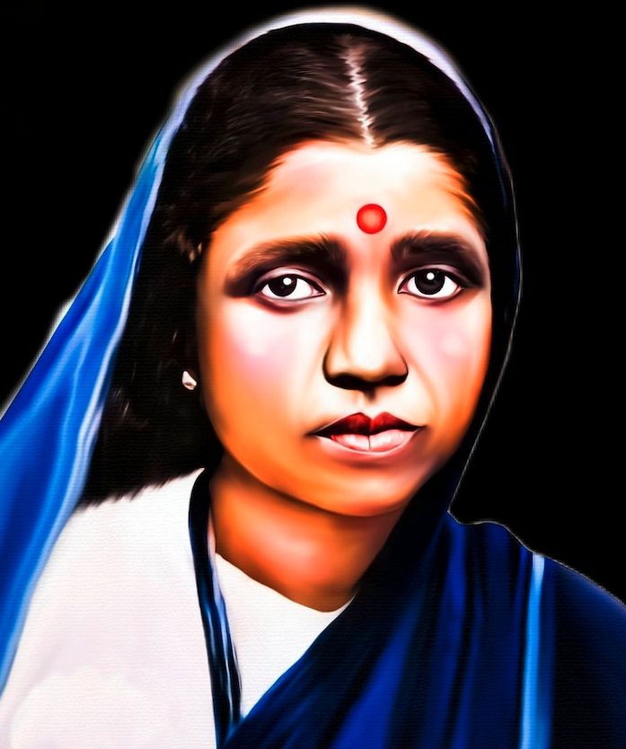

## Disclaimer {.scrollable}

::: {.fragment .fade-in-then-semi-out }

This presentation has been prepared for the **SARA Book Club - Session 2** as part of an internal academic discussion on _Annihilation of Caste_ by Dr. B.R. Ambedkar.

:::

::: {.fragment .fade-in-then-semi-out }

Caste is a sensitive and deeply personal subject. All views expressed during this session are those of individual participants and do not represent the official position of **SARA** or any of its affiliated persons or programmes. SARA bears no responsibility for opinions shared in the course of this discussion.

:::

::: {.fragment .fade-in-then-semi-out }

All participants are requested to engage with **kindness, respect, and restraint.** Language that is provocative, discriminatory, or hurtful toward any community, caste, or individual has no place in this space and will not be encouraged.

:::

::: {.fragment .fade-in-then-semi-out }

The primary purpose of this session is **academic and pedagogical** - to identify the key arguments, ideas, and lessons from Dr. Ambedkar's work that can be meaningfully and sensitively introduced to students in the **SARA Bridge Course Level 1**.

:::

::: {.fragment .fade-in-then-semi-out }

We enter this discussion in the spirit of learning, not of debate or confrontation.

Thank you!

:::

# {background-image="images/aoc-ambedkar.png" background-size="contain" background-position="left" background-color="black" .center-slide}

::: {.columns}

::: {.column}

:::

::: {.column}

 
 

::: {layout-ncol=3 }

![[Expert:]{.highlight} Dr. Vivek Kumar Singh](images/vivek-kumar.png)

![[Moderator:]{.highlight} Dr. Cecilia Baldoni](images/cecilia.png)

![[Presenter:]{.highlight} Dr. Ajay Kumar Koli](images/ajay.jpg)

:::
:::

:::

## {.center-slide}

:::::: columns
::: {.column width="35%"}
{fig-alt="Sara's headshot" fig-align="center" width=250px style="border-radius: 50%;"}

#### Savitribai Phule (1831-1897) 🌺 🙏🏽🌼

:::

::: {.column width="30%"}

{width="2.0in" fig-align="center"}
:::

::: {.column width="35%"}
{fig-alt="Sara's headshot" fig-align="center" width=250px style="border-radius: 50%;"}

#### Ramabai Ambedkar (1898-1935) 🌺 🙏🏽🌼
:::
::::::

[**Savitribai Ramabai (SARA) Institute of Data Science, Sonipat**]{.r-fit-text .muted}

---

## About SARA {background-image="images/diver-she.png" background-size="25%" background-position="70% 70%"}

> An Ambedkarite Non-profit Educational Institute

- Provide low-cost data science education
- Priority admission for marginalised communities & women
- Prevent data injustice

::: footer
SARA website: <https://sara-edu.netlify.app/>
:::

---

## SARA Data Schools {background-color="black"}

::: {.panel-tabset}

### Summer School

::: {#fig-summer layout-ncol=2}

{#fig-surus}

{#fig-hanno}

Participants of the SARA Summer Schools "R for Researchers"
:::

### Winter School 

::: {#fig-winter layout-ncol=2}

{#fig-surus}

{#fig-hanno}

Participants of the SARA Winter Schools "Statistics using R"
:::

### Bootcamp

::: {#fig-bootcamp layout-ncol=2}

{#fig-surus}

{#fig-hanno}

Participants of the SARA Coding Bootcamps "Publish using Quarto"
:::

:::

## 3rd SARA Summer School {.center-slide background-color="black"}

::: {layout="[75, 25]"}

:::

::: footer
More info: <https://sara-edu.netlify.app/summer/2026-r4b/>
:::

## Bridge Course Level 1 {background-image="images/sea-tyre.png" background-size="15%" background-position="45% 95%"} 

> Offline three months course covering essential education (6 to 8 class):

::: {.columns}

::: {.column}

@. Social Science
@. Science
@. Geography
@. History
@. English Language

:::

::: {.column}

@. Environmental Science
@. Mathematics
@. General Knowledge
@. Civics, polity & political economy
@. Computer & AI

:::

:::

## SARA Book Club {.center-slide background-color="black"}

{fig-align="center"}

::: footer
More information <https://sara-edu.netlify.app/book-club/books-donation/sara_book_donations>
:::

## Follow SARA WhatsApp Channel {.center-slide background-color="black"}

{fig-align="center"}

# {background-image="images/ambedkar.jpg" background-color="black" background-size="contain" background-position="middle"}

## Preface to the Second Edition, 1937

> [Besides Mr. Gandhi, many others have adversely criticised my views as expressed in my speech. But I have felt that in taking notice of such adverse comments, I should limit myself to Mr. Gandhi.]{.fragment .fade-in-then-semi-out} [This I have done not because what he has said is so weighty as to deserve a reply, but because to many a Hindu he is an oracle,]{.fragment .fade-in-then-semi-out} [so great that when he opens his lips it is expected that the argument close and no dog must bark.]{.fragment .fade-in-then-semi-out} (page 185)

## Preface to the Second Edition, 1937

> I shall be satisfied if I make the Hindus realise that they are the sick men of India, and that their sickness is causing danger to the health and happiness of other Indians. (page 185)

## Jat-Pat Todak Mandal Conference

> [You are entitled to say that my analysis is wrong. But you cannot say that in an address which deals with the problem of caste it is not open to me to discuss how caste can be destroyed. (page 200)]{.fragment .fade-in-then-semi-out}

> [I cared more for my faith than for any honour from you. (page 201)]{.fragment .fade-in-then-semi-out}

> [This is I believe the first time when the appointment of a president is cancelled by the reception committee because it does not approve of the views of the president. (page 204)]{.fragment .fade-in-then-semi-out}

# Annihilation of Caste

An Undelivered Speech, 1936

## Babasaheb:

> I have criticised the Hindus. I have questioned the authority of the Mahatma whom they revere. They hate me. To them I am a snake in their garden. (para 1.1)

## Hindu Caste Order {background-image="images/varna-system.png" background-size="contain" background-position="right" background-color="black"}

::: {.columns}

::: {.column}

- [Savarna:]{.highlight} "those with varna, a caste Hindu; a term used for those within the fourfold varna system. A Shudra is also a savarna." 

- [Dwija:]{.highlight} "twice born" ... "the first three groups are considered dwija" (page 209, foote-note 4 & 5)

:::

::: {.column}

:::

:::

::: footer
Image source: [britannica.com](https://www.britannica.com/topic/varna-Hinduism)
:::

## Hindu Caste Order {background-image="images/varna-system.png" background-size="contain" background-position="right" background-color="black"}

::: {.columns}

::: {.column}

- Antyaja = Avarna = last born = an untouchable = [Dalit]{.highlight}

- "those outside the pale of the fourfold varna system" (page 209, foot-note 3)

:::

::: {.column}

:::

:::

::: footer
Image source: [britannica.com](https://www.britannica.com/topic/varna-Hinduism)
:::

## Babasaheb:

> [Yours is a cause of social reform. That cause has always made an appeal to me (para 1.4)]{.fragment .fade-in-then-semi-out}

> [Social reform in India has few friends and many critics. (para 2.1)]{.fragment .fade-in-then-semi-out}

## Babasaheb:

> [It was at one time recognised that without social efficiency, no permanent progress in the other fields of activity was possible;]{.fragment .fade-in-then-semi-out} [that owning to mischief wrought by evil customs, Hindu society was not in a state of efficiency (para 2.2)]{.fragment .fade-in-then-semi-out}

::: {.fragment .callout-important}

[Social efficiency:]{.highlight} "for [John] Dewey and Ambedkar social efficiency lies in the individual being able to choose and develop his/her competencies to the fullest and thus mindfully contribute to the functioning of society." (page. 210, foot-note 6)

:::

## Babasaheb:

> [the birth of the National Congress was accompanied by the foundation of the Social Conference (para 2.2)]{.fragment .fade-in-then-semi-out}

> [The point at issue was whether social reform should precede political reform. (para 2.3)]{.fragment .fade-in-then-semi-out}

> [in the course of time the party in favour of political reform won, and the Social Conference vanished and was forgotten (para 2.5)]{.fragment .fade-in-then-semi-out}

# Social Reform First

## Babasaheb:

Treatment of the Untouchables under Peshwas

> [Untouchable was not allowed to use the public streets if a Hindu was coming along, lest he should pollute the Hindu by his shadow.]{.fragment .fade-in-then-semi-out} [The Untouchable was required to have black thread either on his wrist or around his neck, as a sign or a mark to prevent the Hindu from getting themselves polluted by his touch by mistake.]{.fragment .fade-in-then-semi-out} [In Poona, the capital of the Peshwa, the Untouchable was required to carry, strung from his waist, a broom to sweep away from behind himself the dust he trod on, lest a Hindu walking on the same dust should be polluted.]{.fragment .fade-in-then-semi-out} [In Poona, the Untouchable was required to carry an earthen pot hung around his neck wherever he went - for holding his spit, lest spit falling on the earth should polluted a Hindu who might unknowingly happen to tread on it.]{.fragment .fade-in-then-semi-out} (para 2.8)

## Babasaheb:

> [Are you fit for political power even though you do not allow a large class of your own countrymen like the Untouchables to use public schools?]{.fragment .fade-in-then-semi-out} [Are you fit for political power even though you do not allow them the use of public wells?]{.fragment .fade-in-then-semi-out} [Are you fit for political power even though you do not allow them the use of public streets?]{.fragment .fade-in-then-semi-out} [Are you fit for political power even though you do not allow them to wear what apparel or ornaments they like?]{.fragment .fade-in-then-semi-out} [Are you fit for political power even though  you do not allow them to eat any food they like?]{.fragment .fade-in-then-semi-out} (para 2.13)

## Babasaheb:

> [Every congressman who repeats the dogma of Mill that one country is not fit to rule another country, must admit that one class is not fit to rule another class. (para 2.14)]{.fragment .fade-in-then-semi-out}

## Babasaheb:

Social Reform in Hindu family

> [reform of the high-caste Hindu family]{.fragment .fade-in-then-semi-out} [evils which prevailed among them and which were personally felt by them ... widow remarriage, child marriage, etc. (para 2.15 & 2.16)]{.fragment .fade-in-then-semi-out}

## Babasaheb:

Social reform in Hindu Soceity

> [They did not stand up for the reform of Hindu society. The battle that was fought centered round the question of the reform of the family.]{.fragment .fade-in-then-semi-out} [It did not relate to social reform in the sense of the break-up of the caste system.]{.fragment .fade-in-then-semi-out} [It was never put in issue by the reformers. That is the reason why the "social reform party" lost. (para 2.15)]{.fragment .fade-in-then-semi-out} 

## Babasaheb:

Social reform vs Political reform

> [the view that social reform need not precede political reform is a view which may stand only when by social reform is meant the reform of the family.]{.fragment .fade-in-then-semi-out} [That political reform cannot with impunity take precedence over social reform in the sense of the reconstruction of society (para 2.16)]{.fragment .fade-in-then-semi-out} 

> [the makers of political constitutions must take account of social forces (para 2.17)]{.fragment .fade-in-then-semi-out}

## Babasaheb:

The Communal Award 

> [its significance lies in this: that political constitutions must take note of social organisation ...]{.fragment .fade-in-then-semi-out}  [The Communal Award is, so to say, the nemesis following upon the indifference to and neglect of social reform. (para 2.18)]{.fragment .fade-in-then-semi-out}

## The Communal Award 

- 16 August 1932: "Granted separate electorates to minorities" including Depressed Classes/Untouchables

- "The Congress and Gandhi opposed this, and Gandhi went on indefinite hunger strike in Poona jail." 

- 24 September 1932: [Poona Pact]{.highlight} - "the Untouchables were allotted reserved constituencies but not separate electorates" (page 220 foot-note 22)

## Babasaheb:

Irish Home Rule

> there was a social problem between Catholics [Southern Ireland] and Protestants [Ulster], which is essentially a problem of caste. (para. 2.19)

## Irish Home Rule Movement

- "to recover legislative independence from the Britain"

- Catholics were more in numbers, largely living in the southern Ireland wanted Home Rule.

- Protestants were less in numbers, but in majority in northern Ireland, Ulster, did not want Home Rule.

---

## Babasaheb:

History of Rome

> [the republican constitution of Rome bore marks having strong resemblance to the Communal Award]{.fragment .fade-in-then-semi-out} [the constitution of republican Rome has to take account of the social division between the patricians and the plebeians, who formed two distinct castes (para. 2.20)]{.fragment .fade-in-then-semi-out}

## Ancient Rome

- **Patricians:** old noble families who believed birth gave them the right to rule everything.

- **Plebeians:** everyone else, who slowly and cleverly fought back and won most of their rights through collective action.

- **Secession of the Plebs:** They walked out of Rome and sat on a hill outside the city saying - *fine, run Rome without us. See how long your army lasts, your farms produce food, your city functions* - without us.

::: footer
This is AI created information. 
:::

## Babasaheb:

> [To sum up, let political reformers turn in any direction they like, they will find that in the making of a constitution, they cannot ignore the problem arising out of the prevailing social order. (para 2.20)]{.fragment .fade-in-then-semi-out}

## Babasaheb:

> [history bears out the proposition that political revolutions have always been preceded by social and religious revolutions ...]{.fragment .fade-in-then-semi-out} [emancipation of the mind and the soul is a necessary for the political expansion of the people (para 2.21)]{.fragment .fade-in-then-semi-out}

