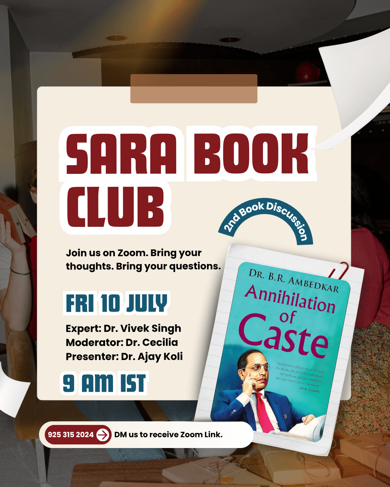
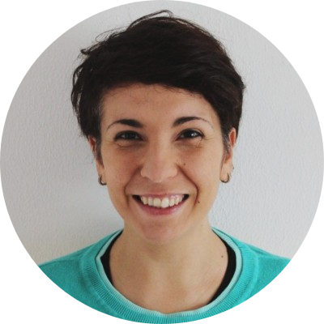
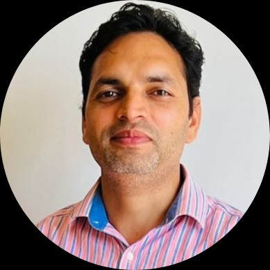

## SARA Book Club {background-color="black" .center-slide}

::: {.columns}

::: {.column}

{fig-align="center"}

:::

::: {.column}

 
 

::: {layout-ncol=3 }

:::
:::

:::

## {.center-slide}

:::::: columns
::: {.column width="35%"}
{fig-alt="Sara's headshot" fig-align="center" width=250px style="border-radius: 50%;"}

#### Savitribai Phule (1831-1897) 🌺 🙏🏽🌼

:::

::: {.column width="30%"}

{width="2.0in" fig-align="center"}
:::

::: {.column width="35%"}
{fig-alt="Sara's headshot" fig-align="center" width=250px style="border-radius: 50%;"}

#### Ramabai Ambedkar (1898-1935) 🌺 🙏🏽🌼
:::
::::::

[**Savitribai Ramabai (SARA) Institute of Data Science, Sonipat**]{.r-fit-text .muted}

---

## About SARA {background-image="images/diver-she.png" background-size="25%" background-position="70% 70%"}

> An Ambedkarite Non-profit Educational Institute

- Provide low-cost data science education
- Priority admission for marginalised communities & women
- Prevent data injustice

---

## Data Schools {background-color="black"}

::: {.panel-tabset}

### Summer School

::: {#fig-summer layout-ncol=2}

{#fig-surus}

{#fig-hanno}

Participants of the SARA Summer Schools "R for Researchers"
:::

### Winter School 

::: {#fig-winter layout-ncol=2}

{#fig-surus}

{#fig-hanno}

Participants of the SARA Winter Schools "Statistics using R"
:::

### Bootcamp

::: {#fig-bootcamp layout-ncol=2}

{#fig-surus}

{#fig-hanno}

Participants of the SARA Coding Bootcamps "Publish using Quarto"
:::

:::

## 3rd SARA Summer School {.center-slide background-color="black"}

{fig-align="center"}

## Bridge Course Level 1 {background-image="images/sea-tyre.png" background-size="15%" background-position="30% 90%"} 

> Around three months offline course covering essential:

::: {.columns}

::: {.column}

@. Social Science
@. Science
@. Geography
@. History

:::

::: {.column}

@. Environmental Science
@. Mathematics
@. General Knowledge
@. Civics, polity & political economy

:::

:::

## Around 40 Books {.center-slide background-color="black"}

{fig-align="center"}

::: footer
More information <https://sara-edu.netlify.app/book-club/books-donation/sara_book_donations>
:::

## SARA WhatsApp Channel {.center-slide background-color="black"}

{fig-align="center"}

